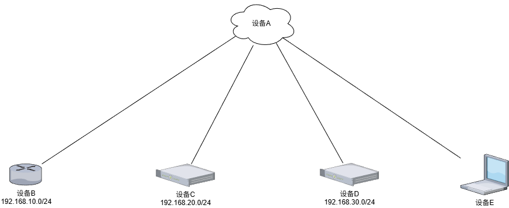

# WireGuard 异地组网配置过程

---

## 现状
设备A: 公网CES服务器，有固定公网IP(100.107.21.78)，系统为 Deabin 13

设备B: 家庭路由，无固定公网IP，当前内网网关，内网网段为(192.168.10.0/24)

设备C: 外部服务器，无固定公网IP，非当前内网网关，内网网段为(192.168.20.0/24)，系统为 Deabin 13

设备D: 外部服务器，无固定公网IP，非当前内网网关，内网网段为(192.168.30.0/24)，系统为 Deabin 13

设备E: 外部 Windows 电脑，无固定公网IP

---

## 需求
1. `设备B` 需要访问 `设备C`、`设备D` 内网网段

2. `设备C` 需要访问 `设备B` 内网网段

3. `设备E` 需要访问 `设备B`、`设备C` 、 `设备D` 内网网段

---

## 实现思路
拓扑: Hub-Spoke 星型


WireGuard组网IP分配:
- 设备A: 10.17.1.1/24
- 设备B: 10.17.1.10/24
- 设备C: 10.17.1.20/24
- 设备D: 10.17.1.30/24
- 设备E: 10.17.1.201/24

实现难点:
> 设备C与设备D不是内网网关，发送的数据包需要通过防火墙做 snat 伪装才能正常联通

---

## 配置

### 设备A
```
# /etc/wireguard/wg0.conf
[Interface]
Address = 10.17.1.1/24
ListenPort = 60000
PrivateKey = <设备A私钥>
MTU = 1280

# 创建 wireguard_server 表，并允许 wg0 接口之间的数据包相互转发
# 这是作为中心中转节点必须配置的
PostUp = nft add table ip wireguard_server
PostUp = nft add chain ip wireguard_server forward '{ type filter hook forward priority 0; policy accept; }'
PostUp = nft add rule ip wireguard_server forward iifname "wg0" oifname "wg0" accept
PostDown = nft delete table ip wireguard_server

# 设备B
[Peer]
PublicKey = <设备B公钥>
AllowedIPs = 10.17.1.10/32, 192.168.10.0/24

# 设备C
[Peer]
PublicKey = <设备C公钥>
AllowedIPs = 10.17.1.20/32, 192.168.20.0/24

# 设备D
[Peer]
PublicKey = <设备D公钥>
AllowedIPs = 10.17.1.30/32, 192.168.30.0/24

# 设备E
[Peer]
PublicKey = <设备E公钥>
AllowedIPs = 10.17.1.201/32
```

### 设备B
```
[Interface]
Address = 10.17.1.10/24
PrivateKey = <设备B私钥>
MTU = 1280

# 路由不需要创建 wireguard_client 表

[Peer]
PublicKey = <设备A公钥>
# 这里填写设备A的公网IP+wireguard监听端口即可
Endpoint = 100.107.21.78:60000
# 将发往 WG网段、设备C/D 内网网段的流量全部丢入隧道
AllowedIPs = 10.17.1.0/24, 192.168.20.0/24, 192.168.30.0/24
PersistentKeepalive = 10
```

### 设备C
```
# /etc/wireguard/wg0.conf
[Interface]
Address = 10.17.1.20/24
PrivateKey = <设备C私钥>
MTU = 1280

# 创建 wireguard_client 表
PostUp = nft add table ip wireguard_client
# 允许由 wg0 进入的数据包被转发
PostUp = nft add chain ip wireguard_client forward '{ type filter hook forward priority 0; policy accept; }'
PostUp = nft add rule ip wireguard_client forward iifname "wg0" accept
# 开启 NAT 伪装：将来自 WG 网段、B设备内网网段的流量全部伪装为设备C的内网IP
PostUp = nft add chain ip wireguard_client nat '{ type nat hook postrouting priority 100; policy accept; }'
PostUp = nft add rule ip wireguard_client nat ip saddr { 10.17.1.0/24, 192.168.10.0/24 } masquerade
PostDown = nft delete table ip wireguard_client

[Peer]
PublicKey = <设备A公钥>
Endpoint = 100.107.21.78:60000
AllowedIPs = 10.17.1.0/24, 192.168.10.0/24
PersistentKeepalive = 10
```

### 设备D
```
# /etc/wireguard/wg0.conf
[Interface]
Address = 10.17.1.30/24
PrivateKey = <设备D私钥>
MTU = 1280

PostUp = nft add table ip wireguard_client
PostUp = nft add chain ip wireguard_client forward '{ type filter hook forward priority 0; policy accept; }'
PostUp = nft add rule ip wireguard_client forward iifname "wg0" accept
PostUp = nft add chain ip wireguard_client nat '{ type nat hook postrouting priority 100; policy accept; }'
PostUp = nft add rule ip wireguard_client nat ip saddr { 10.17.1.0/24, 192.168.10.0/24 } masquerade
PostDown = nft delete table ip wireguard_client

[Peer]
PublicKey = <设备A公钥>
Endpoint = 100.107.21.78:60000
AllowedIPs = 10.17.1.0/24
PersistentKeepalive = 10
```

### 设备E
```
[Interface]
Address = 10.17.1.201/24
PrivateKey = <设备E私钥>
MTU = 1280

[Peer]
PublicKey = <设备A公钥>
Endpoint = 100.107.21.78:60000
AllowedIPs = 10.17.1.0/24, 192.168.10.0/24, 192.168.20.0/24, 192.168.30.0/24
PersistentKeepalive = 10
```

---

## 常见问题
Q: 私钥和公钥如何生成？
> A: 私钥 `wg genkey` 公钥 `echo "获取的私钥" | wg pubkey`